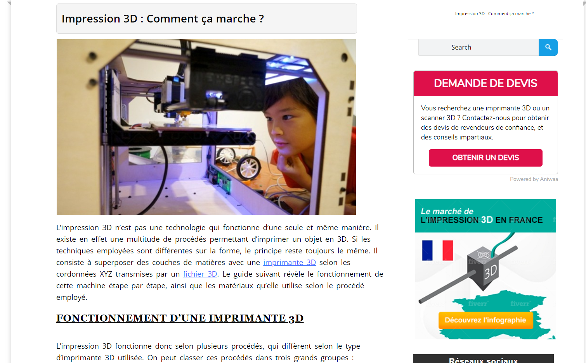
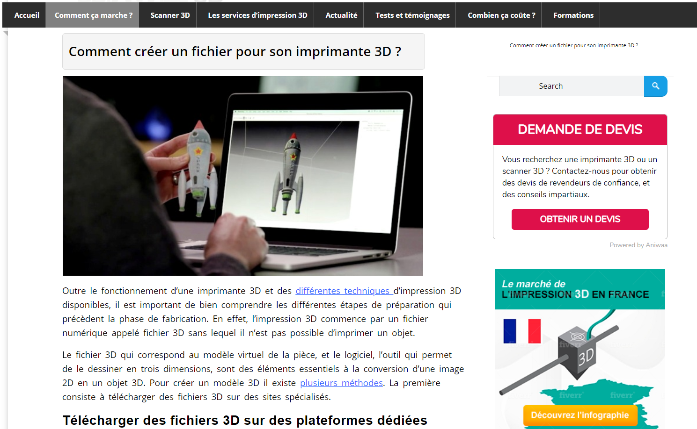
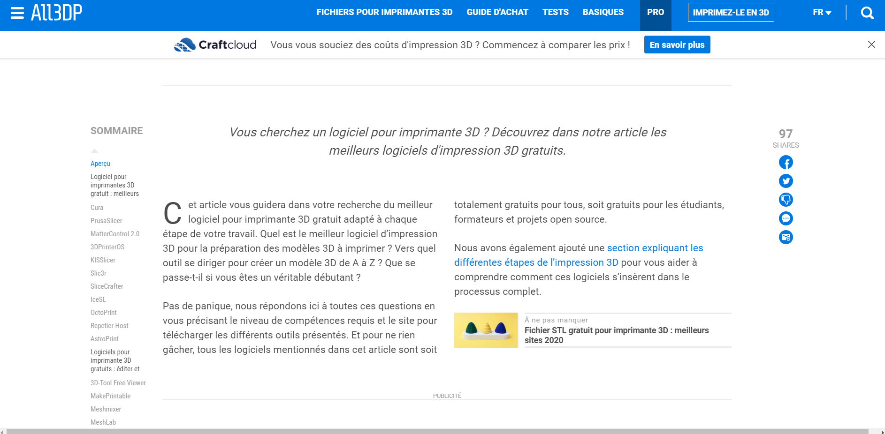

# Fonctionnement

1. [Comment ça marche ?](http://www.primante3d.com/principe/)

2. [Comment créer un fichier pour son imprimante 3D ?](http://www.primante3d.com/modeliser/)

3. [Liste des meilleurs logiciels](https://all3dp.com/fr/1/meilleur-logiciel-imprimante-3d-gratuit-en-ligne/)

