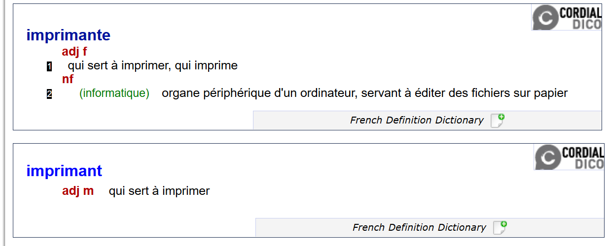
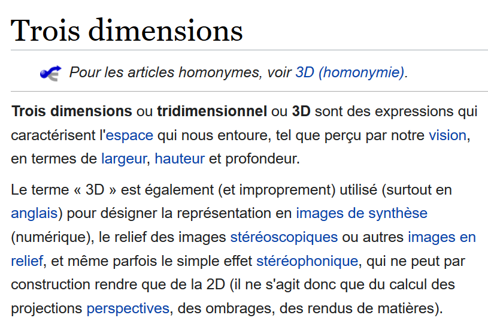
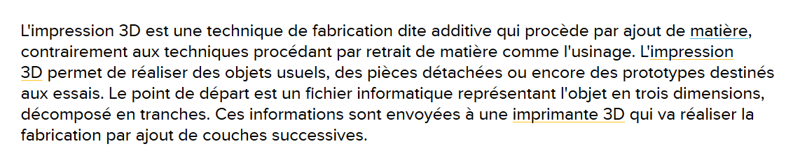

# Définitions de "Imprimante 3D"

1. [Définition du terme "imprimante" sur Reverso](https://dictionary.reverso.net/french-definition/Imprimante)

2. [Définition du terme "Trois Dimensions" sur wiképia](https://fr.wikipedia.org/wiki/Trois_dimensions)

3. [Définition du terme "impression 3D" sur future-science](https://www.futura-sciences.com/tech/definitions/imprimante-3d-impression-3d-15137/)

