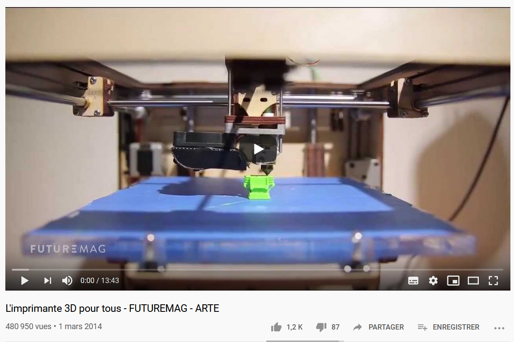
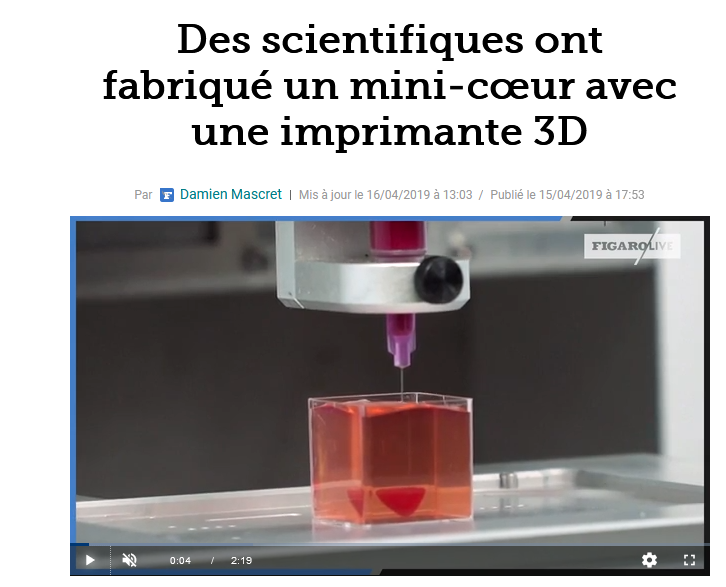

# Quelques démonstrations 

1. [Démonstration basique](https://www.youtube.com/watch?v=AWzjTxuhImQ)

2. [Fabrication d'un coeur ?](https://sante.lefigaro.fr/article/des-scientifiques-ont-fabrique-un-mini-coeur-avec-une-imprimante-3d/)

