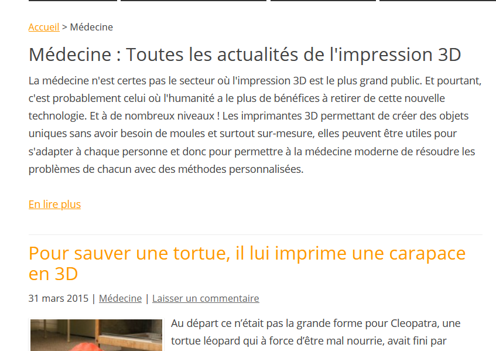

# L'imprimante 3D en médecine

1. [Quelques exemples...](http://www.monunivers3d.com/medecine/)

2. [Révolution de la médecine !](https://www.rtbf.be/info/regions/hainaut/detail_l-imprimante-3d-au-service-de-la-traumatologie-cranienne-a-charleroi?id=9440729)

![image](images/
