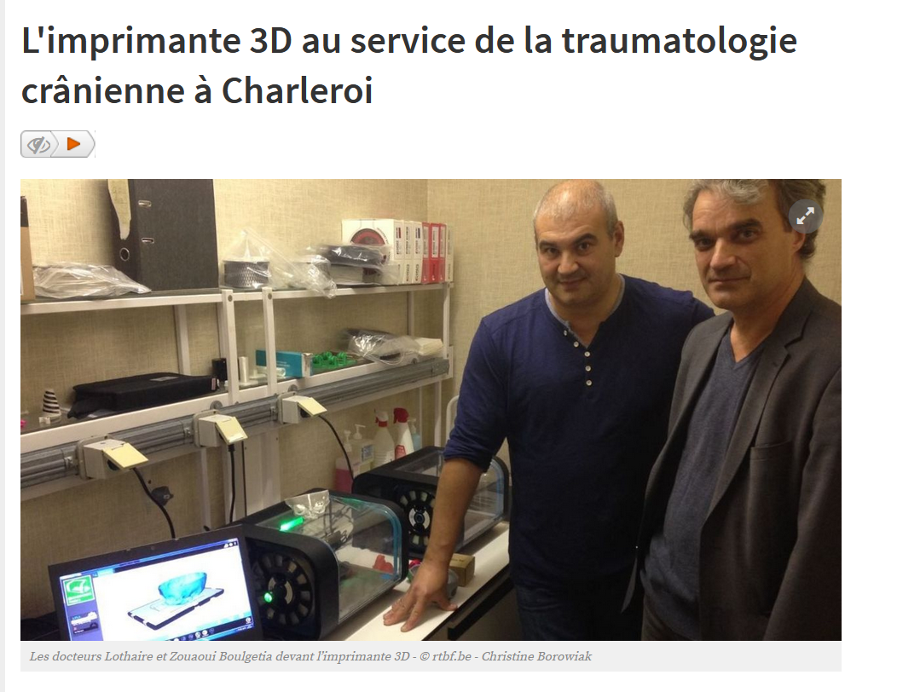

# L'imprimante 3D en médecine

1. [Quelques exemples...](http://www.monunivers3d.com/medecine/)  
Flavien Chantrel (Auteur). « Médecine Archives ». In MonUnivers3D [en ligne]. 2017 [Consulté le 30 mai 2020]. Disponible à l’adresse : http://www.monunivers3d.com/medecine/
  

2. [Révolution de la médecine !](https://www.rtbf.be/info/regions/hainaut/detail_l-imprimante-3d-au-service-de-la-traumatologie-cranienne-a-charleroi?id=9440729)  
Christine Borowiak (auteur). « L’imprimante 3D au service de la traumatologie crânienne à Charleroi ». RTBF Info [en ligne]. 26 octobre 2016. [Consulté le 30 mai 2020]. Disponible à l’adresse : https://www.rtbf.be/info/regions/hainaut/detail_l-imprimante-3d-au-service-de-la-traumatologie-cranienne-a-charleroi?id=9440729

