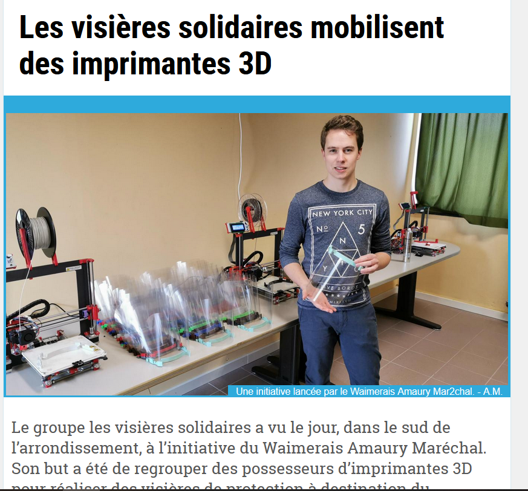
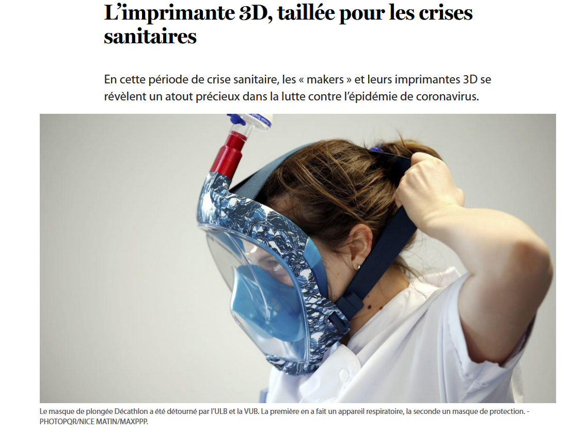

# Services à la population

1. [Des visières ?](https://verviers.lameuse.be/541838/article/2020-04-02/les-visieres-solidaires-mobilisent-des-imprimantes-3d)  
Aurélie Fransolet (auteur). « Les visières solidaires mobilisent des imprimantes 3D ». In _Édition digitale de Verviers_ [en ligne]. 2 avril 2020. [Consulté le 30 mai 2020]. Disponible à l’adresse : http://verviers.lameuse.be/541838/article/2020-04-02/les-visieres-solidaires-mobilisent-des-imprimantes-3d

2. [Au secours des soignants - Covid 19](https://plus.lesoir.be/295209/article/2020-04-17/limprimante-3d-taillee-pour-les-crises-sanitaires)  
Thomas Casavecchia (journaliste). « L’imprimante 3D, taillée pour les crises sanitaires ». In _Le Soir Plus_ [en ligne]. [s. d.]. [Consulté le 30 mai 2020]. Disponible à l’adresse : https://plus.lesoir.be/295209/article/2020-04-17/limprimante-3d-taillee-pour-les-crises-sanitaires

